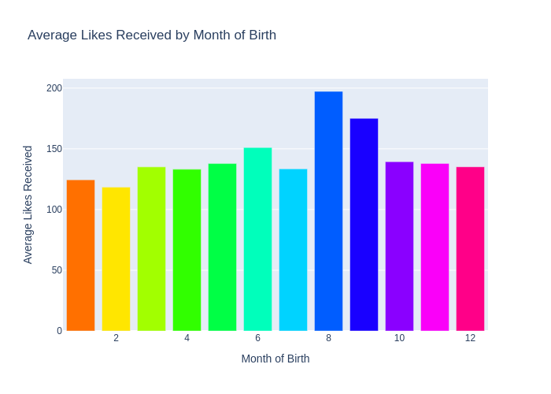
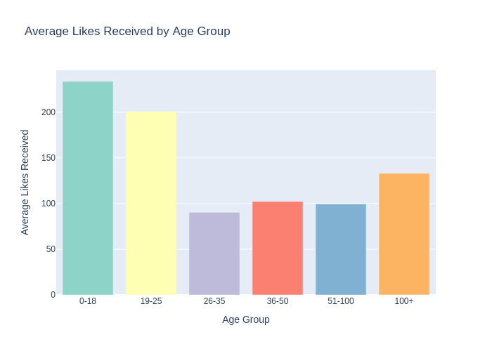
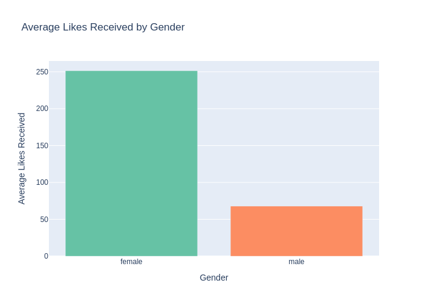
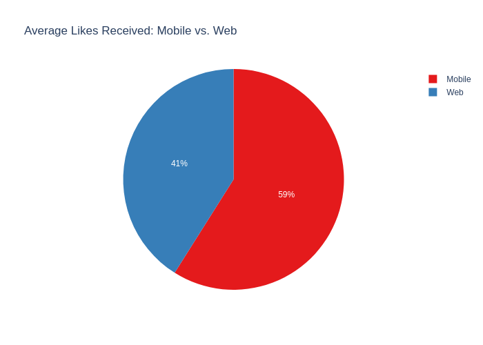
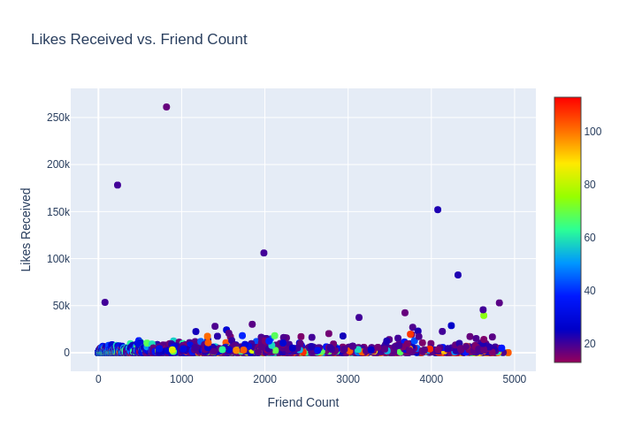
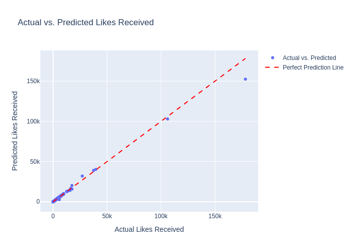

# Likes & Reach: Decoding Facebook User Engagement

## Overview
This project analyzes Facebook user engagement using a dataset of 99,003 users, focusing on `likes_received`. It includes data cleaning, exploratory visualizations, and predictive modeling with Random Forest regression.

## Visualizations

## Installation
1. Clone the repository: `git clone https://github.com/yourusername/facebook-engagement.git`
2. Install dependencies: `pip install -r requirements.txt`
3. Download `pseudo_facebook.csv` and place it in the `data/` folder.

## Usage
Open `facebook_engagement.ipynb` in Jupyter Notebook and run all cells.

## License
MIT License
